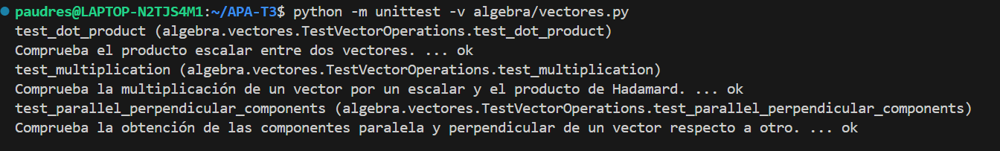

# Tercera tarea de APA: Multiplicaciones de vectores y ortogonalidad

## Nom i cognoms: Pau Dresaire Osete

El fichero `algebra/vectores.py` incluye la definición de la clase `Vector` con los
métodos desarrollados en clase, que incluyen la construcción, representación y
adición de vectores, entre otros.

Añada a este fichero los métodos siguientes, junto con sus correspondientes
tests unitarios.

### Multiplicación de los elementos de dos vectores (Hadamard) o de un vector por un escalar

- Sobrecargue el operador asterisco (`*`, correspondiente a los métodos `__mul__()`,
  `__rmul__()`, etc.) para implementar el producto de Hadamard (vector formado por
  la multiplicación elemento a elemento de dos vectores) o la multiplicación de un
  vector por un escalar.

  - La prueba unitaria consistirá en comprobar que, dados `v1 = Vector([1, 2, 3])` y
    `v2 = Vector([4, 5, 6])`, la multiplicación de `v1` por `2` es `Vector([2, 4, 6])`,
    y el producto de Hadamard de `v1` por `v2` es `Vector([4, 10, 18])`.

- Sobrecargue el operador arroba (`@`, multiplicación matricial, correspondiente a los
  métodos `__matmul__()`, `__rmatmul__()`, etc.) para implementar el producto escalar
  de dos vectores.

  - La prueba unitaria consistirá en comprobar que el producto escalar de los dos
    vectores `v1` y `v2` del apartado anterior es igual a `32`.

### Obtención de las componentes normal y paralela de un vector respecto a otro

Dados dos vectores $v_1$ y $v_2$, es posible descomponer $v_1$ en dos componentes,
$v_1 = v_1^\parallel + v_1^\perp$ tales que $v_1^\parallel$ es tangencial (paralela) a
$v_2$, y $v_1^\perp$ es normal (perpendicular) a $v_2$.

> Se puede demostrar:
>
> - $v_1^\parallel = \frac{v_1\cdot v_2}{\left|v_2\right|^2} v_2$
> - $v_1^\perp = v_1 - v_1^\parallel$

- Sobrecargue el operador doble barra inclinada (`//`, métodos `__floordiv__()`,
  `__rfloordiv__()`, etc.) para que devuelva la componente tangencial $v_1^\parallel$.

- Sobrecargue el operador tanto por ciento (`%`, métodos `__mod__()`, `__rmod__()`, etc.)
  para que devuelva la componente normal $v_1^\perp$.

> Es discutible esta elección de las sobrecargas, dado que extraer la componente
> tangencial no es equivalente a ningún tipo de división. Sin embargo, está
> justificado en el hecho de que su representación matemática es dos barras
> paralelas ($\parallel$), similares a las usadas para la división entera (`//`).
>
> Por otro lado, y de manera *parecida* (aunque no idéntica) al caso de la división
> entera, las dos componentes cumplen: `v1 = v1 // v2 + v1 % v2`, lo cual justifica
> el empleo del tanto por ciento para la componente normal.

- En este caso, las pruebas unitarias consistirán en comprobar que, dados los vectores
  `v1 = Vector([2, 1, 2])` y `v2 = Vector([0.5, 1, 0.5])`, la componente de `v1` paralela
  a `v2` es `Vector([1.0, 2.0, 1.0])`, y la componente perpendicular es `Vector([1.0, -1.0, 1.0])`.

### Entrega

#### Fichero `algebra/vectores.py`

- El fichero debe incluir una cadena de documentación que incluirá el nombre del alumno
  y los tests unitarios de las funciones incluidas.

- Cada función deberá incluir su propia cadena de documentación que indicará el cometido
  de la función, los argumentos de la misma y la salida proporcionada.

- Se valorará lo pythónico de la solución; en concreto, su claridad y sencillez, y el
  uso de los estándares marcados por PEP-ocho.

#### Ejecución de los tests unitarios

Inserte a continuación una captura de pantalla que muestre el resultado de ejecutar el
fichero `algebra/vectores.py` con la opción *verbosa*, de manera que se muestre el
resultado de la ejecución de los tests unitarios.




#### Código desarrollado

Inserte a continuación el código de los métodos desarrollados en esta tarea, usando los
comandos necesarios para que se realice el realce sintáctico en Python del mismo (no
vale insertar una imagen o una captura de pantalla, debe hacerse en formato *markdown*).

```
"""
Módulo de operaciones con vectores.

Autor: Pau
Descripción: Implementación de la clase Vector con operaciones básicas, incluyendo suma, resta,
multiplicación, producto escalar, y descomposición en componentes paralela y normal.
Incluye pruebas unitarias para validar las funciones implementadas.
"""

import unittest

class Vector:
    """
    Clase usada para trabajar con vectores sencillos.
    """
    def __init__(self, iterable):
        """
        Constructor de la clase Vector.
        
        Argumentos:
        iterable -- Un iterable con las componentes del vector.
        """
        self.vector = [valor for valor in iterable]

    def __repr__(self):
        """
        Representación oficial del vector para reconstrucción mediante corta-y-pega.
        """
        return 'Vector(' + repr(self.vector) + ')'

    def __str__(self):
        """
        Representación en formato de lista del vector.
        """
        return str(self.vector)

    def __getitem__(self, key):
        """
        Obtiene un elemento o una porción del vector.
        """
        return self.vector[key]

    def __setitem__(self, key, value):
        """
        Asigna un valor a una componente o una porción del vector.
        """
        self.vector[key] = value

    def __len__(self):
        """
        Devuelve la longitud del vector.
        """
        return len(self.vector)

    def __add__(self, other):
        """
        Suma al vector otro vector o una constante.
        """
        if isinstance(other, (int, float, complex)):
            return Vector(uno + other for uno in self)
        else:
            return Vector(uno + otro for uno, otro in zip(self, other))

    __radd__ = __add__

    def __neg__(self):
        """
        Invierte el signo del vector.
        """
        return Vector([-1 * item for item in self])

    def __sub__(self, other):
        """
        Resta al vector otro vector o una constante.
        """
        return -(-self + other)

    def __rsub__(self, other):
        """
        Resta reflejada cuando el primer operando no es un Vector.
        """
        return -self + other
    
    def __mul__(self, other):
        """
        Producto de Hadamard o multiplicación por un escalar.
        """
        if isinstance(other, (int, float, complex)):
            return Vector(item * other for item in self)
        else:
            return Vector(uno * otro for uno, otro in zip(self, other))

    __rmul__ = __mul__

    def __matmul__(self, other):
        """
        Producto escalar entre dos vectores.
        """
        return sum(uno * otro for uno, otro in zip(self, other))

    __rmatmul__ = __matmul__
    
    def __floordiv__(self, other):
        """
        Devuelve la componente tangencial (paralela) de un vector respecto a otro.
        """
        factor = (self @ other) / (other @ other)
        return Vector(factor * item for item in other)
    
    __rfloordiv__ = __floordiv__
    
    def __mod__(self, other):
        """
        Devuelve la componente normal (perpendicular) de un vector respecto a otro.
        """
        return self - (self // other)
    
    __rmod__ = __mod__

class TestVectorOperations(unittest.TestCase):
    """
    Pruebas unitarias para la clase Vector.
    """
    def test_multiplication(self):
        """
        Comprueba la multiplicación de un vector por un escalar y el producto de Hadamard.
        """
        v1 = Vector([1, 2, 3])
        v2 = Vector([4, 5, 6])
        self.assertEqual(v1 * 2, Vector([2, 4, 6]))
        self.assertEqual(v1 * v2, Vector([4, 10, 18]))

    def test_dot_product(self):
        """
        Comprueba el producto escalar entre dos vectores.
        """
        v1 = Vector([1, 2, 3])
        v2 = Vector([4, 5, 6])
        self.assertEqual(v1 @ v2, 32)
    
    def test_parallel_perpendicular_components(self):
        """
        Comprueba la obtención de las componentes paralela y perpendicular de un vector respecto a otro.
        """
        v1 = Vector([2, 1, 2])
        v2 = Vector([0.5, 1, 0.5])
        self.assertEqual(v1 // v2, Vector([1.0, 2.0, 1.0]))
        self.assertEqual(v1 % v2, Vector([1.0, -1.0, 1.0]))

if __name__ == "__main__":
    unittest.main()
```


#### Subida del resultado al repositorio GitHub y *pull-request*

La entrega se formalizará mediante *pull request* al repositorio de la tarea.

El fichero `README.md` deberá respetar las reglas de los ficheros Markdown y
visualizarse correctamente en el repositorio, incluyendo la imagen con la ejecución de
los tests unitarios y el realce sintáctico del código fuente insertado.
